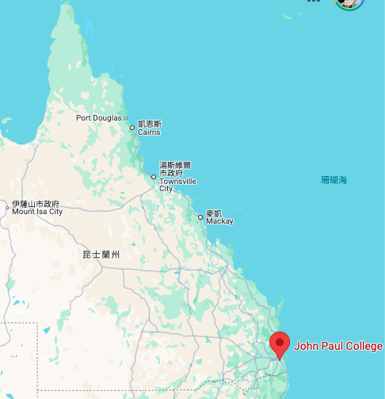
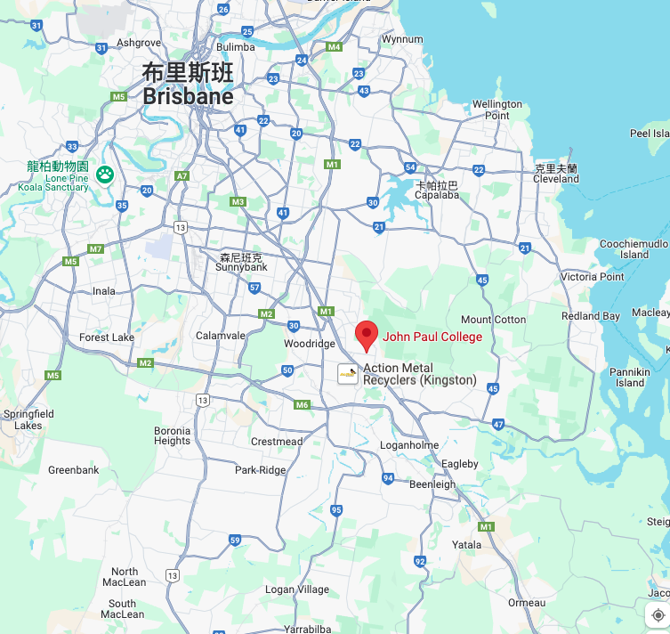
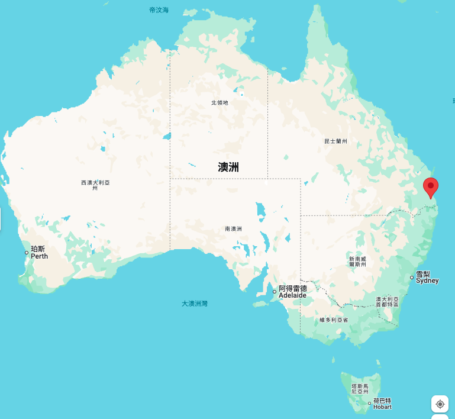
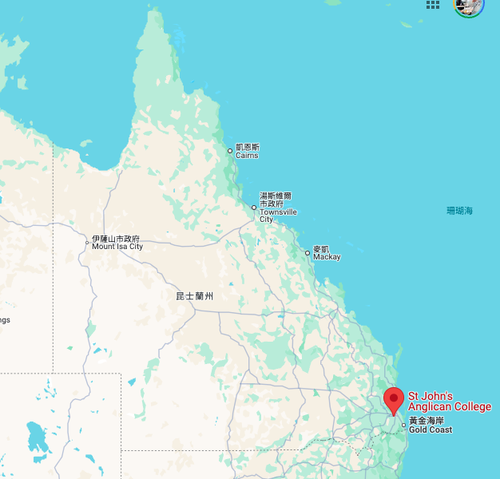
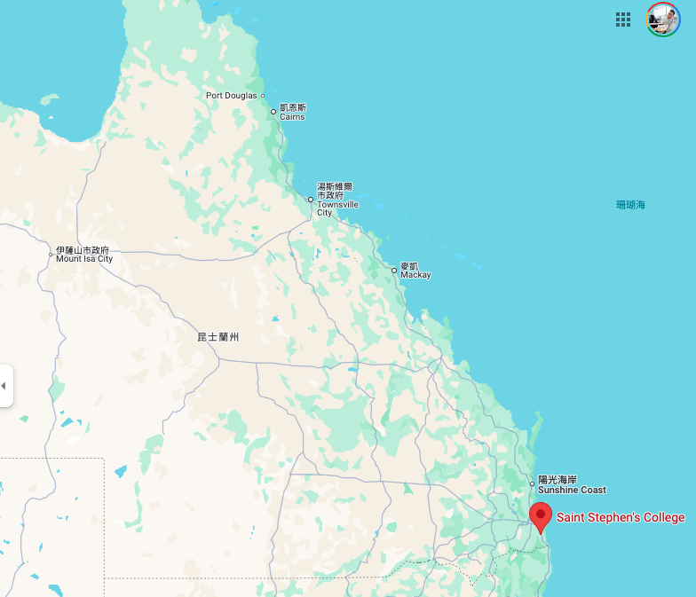
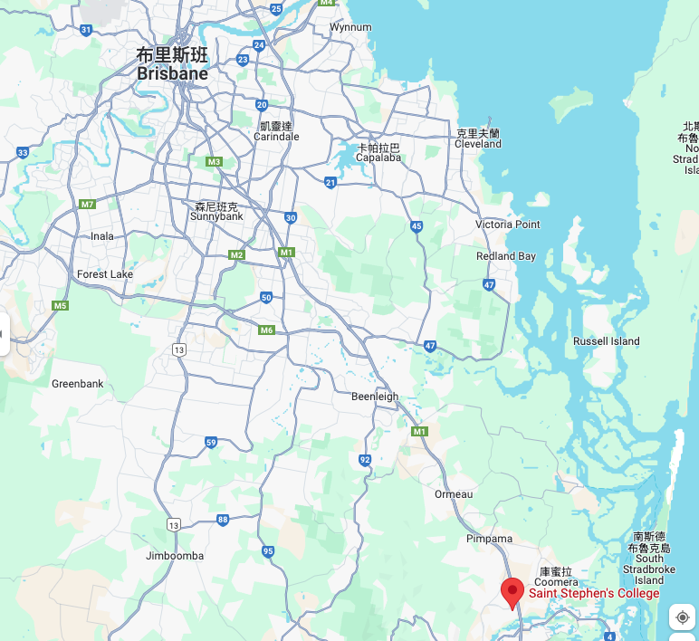

# 學校基本環境

 

## John Paul College (JPC)

1. 地理位置：昆士蘭州布里斯本的達西 (Daisy Hill)。

 

2. 地理座標：-27.64451, 153.09605。

    

    

 

3. 附近城市：布里斯本 (Brisbane)。

 

4. 交通便利：學校距離布里斯本市中心約20分鐘車程，靠近M1高速公路，交通方便，適合日常通勤。

 

5. 當地居民族群：主要為澳大利亞本地居民及部分國際移民，該地區人口組成多元。

 

6. 消費水平：屬於中高等消費區域，當地房地產和生活成本較高。

 

## St John’s Anglican College

1. 地理位置：昆士蘭州布里斯本的森林湖 (Forest Lake)。

2. 地理座標：-27.6156, 152.9748。

    

    

 

3. 附近城市：布里斯本。

 

4. 交通便利：距離布里斯本市中心約30分鐘車程，學校周圍有完善的公共交通系統，方便學生和家長通行。

 

5. 當地居民族群：主要為中產階級家庭，當地居民以澳大利亞本地人為主，也有部分亞裔和其他國際社群。

 

6. 消費水平：消費水平相對較親民，房價和生活成本較布里斯本市中心低。

 

## Saint Stephen's College

1. 地理位置：昆士蘭州的高地公園 (Upper Coomera)。

 

2. 地理座標：-27.8783, 153.3086。

    

    

 

3. 附近城市：黃金海岸 (Gold Coast)。

 

4. 交通便利：學校靠近黃金海岸，距離約30分鐘車程，並有主要道路通往布里斯本，交通便利。

 

5. 當地居民族群：當地居民以澳大利亞本地人為主，且擁有較多國際背景的家庭，特別是來自歐洲和亞洲的移民。

 

6. 消費水平：當地的消費水平適中，黃金海岸地區因為旅遊業發達，物價略高，但與布里斯本市相比仍具相對可負擔性。

 
